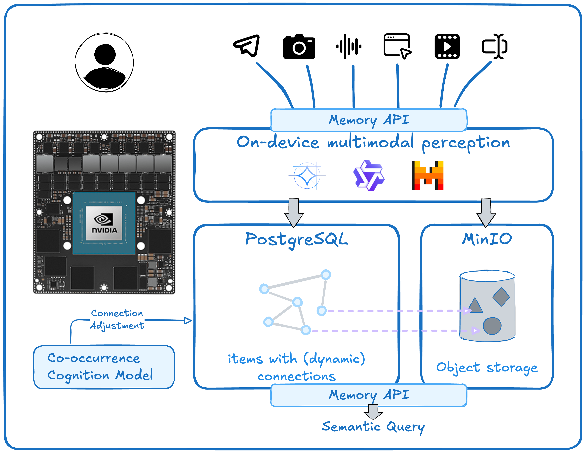

# Memory: (Yet Another) (Vectorized) Second ~~Brain~~ Hippocampus

A backend service for ingesting, storing, and retrieving event logs with semantic search capabilities.

## Foreword

You might have seen applications claiming to be a "second brain" or "personal knowledge management" system for you: Obsidian, Roam Research, Logseq, ..., they bring you with great experience on writing, or journaling, they provide you with fancy knowledge graph, great convenience on bi-links, abundant extensible plugin system, etc. I used to be a fan of them to.

but as a person who is always easily distracted and not so well-organized, sitting down at the table and starting to type long paragraphs seems a bit hard for me. 

Luckily with a burst of LLMs since 2022, NLP become so popular that everyone get easily hands on related technologies, and empowered with AI-coding tools, we can start to build something for our own. So this is it, the *Synapse: a Memory System*. It won't try to think in place of you, it just tries to be your auxiliary hippocampus well: remembering and effortlessly finding, regradless of the way you stored it.

Also, the presence of Nvidia's Jetson series device makes inferencing on multiple LLMs with a consumer-grade hardware (that many of us are affordable) possible. Actually this project is mainly designated for and with a `Jetson AGX Orin`. This bad boy's 275 TOPS AI performance and 64GB of unified memory is brutal, while all of these runs on a ~50w power source! It can definately be your own AI server!

## System Architecture

> **This project is still under development, and had not been tested on non-Jetson devices.**

The system is built on a decoupled, asynchronous architecture to ensure scalability and responsiveness. The core components work together to handle ingestion and retrieval pipelines.



Data Flow:
- Ingestion: The FastAPI endpoint receives a request. Simple content like text is processed synchronously. Complex tasks (image analysis, web scraping) are pushed to a background task queue. The original file is saved to MinIO, while metadata and the resulting embedding are stored in PostgreSQL.
- Retrieval: A user query is converted into an embedding vector. A similarity search is performed against the pgvector index in PostgreSQL, retrieving the top_k most relevant items.

## Features

This is a project focusing on **remembering** things and prepare for queries to **find** them later. 

- Ingest **multimodal** content types (text, images, audio, video, web links, ...) with `Gemma-3n`;
- Semantic search with embedding-based retrieval (and reranking);
- Async Background processing for complex content
- **Bi-directional relationship** tracking between items 
- Privacy: everything is self-hosted.
- Self-adjustment: the developer is working on a simulated cognition model that updates the connection strength over time and usage of the system. Stay tuned!

TODO:
- [ ] Web link scraping
- [ ] Automatically create/update links based on user behaviour

### How We Use Gemma for Multimodal Understanding
We leverage Gemma's multimodal capabilities during the ingestion analysis phase to enrich the data before it's stored. This is a crucial step that makes our semantic search far more powerful.
- For Image Content: An image file itself is not searchable. When an image is ingested, we don't just store it. We pass the image to Gemma, which generates a rich, descriptive text caption. This caption becomes the analyzed_text for the memory item. This allows a user to later find a photo by describing its content, e.g., "a photo of a whiteboard with architecture diagrams."
- For Videos: like the image, but take a frame every other 1 seconds, send them along with the full sound track to Gemma for understanding.
- For Web Links: Instead of just storing a URL, our background processor scrapes the page content. This raw HTML/text is then passed to Gemma for summarization. The concise summary is stored as analyzed_text and embedded, capturing the essence of the link.
- For Long Text: Gemma can be used to extract key entities, topics, or provide a summary, creating a more dense and meaningful representation for embedding.
By using Gemma to translate multimodal content into searchable text, we unify all information into a common semantic space.

### Technical Choices & Justification
Every technology in our stack was chosen to meet specific engineering goals: performance, scalability, and developer experience.
| Component | Technology | Justification|
|:-:|:-:|:-|
| API Framework | FastAPI | Its asynchronous nature (ASGI) provides high performance for I/O-bound tasks. Pydantic integration ensures robust data validation out-of-the-box. |
| Vector Database | PostgreSQL + pgvector | Integrated solution avoids the complexity of maintaining separate relational and vector databases. Enables powerful metadata filtering and efficient vector search in a single, transaction-safe environment. |
| Object Storage | MinIO | Self-hostable, S3-compatible object store ideal for raw binary files (images, audio). Decouples file storage from application logic and database.|
| Development Environment | Nix + direnv | Ensures a reproducible development environment for all contributors, eliminating "it works on my machine" issues and simplifying dependency management. |
| Embedding Model | Qwen3-Embedding series | performs well for all kinds of downstream tasks, while flexible in size for choices. |
| Multimodal Understanding | Gemma-3n-E4B | performs best among all multimodel that fits on an consumer grade hardware. | 

### Challenges Overcome
Building this system presented several key technical challenges:
- Challenge: Handling Diverse, Multimodal Input.
  - Problem: A memory system must accept anything from a one-line text to a full video. A single processing pipeline would be inefficient and complex.
  - Solution: We designed a two-path ingestion system. A synchronous path for quick text entries and an asynchronous path using a task queue for time-consuming processes like media analysis with Gemma or web scraping. This keeps the API responsive while handling heavy workloads in the background.
- Challenge: Bridging the Semantic Gap Between Query and Content.
  - Problem: A user's search query ("notes from the project meeting") might not contain the exact keywords present in the stored item ("sync-up about the Q3 timeline").
  - Solution: We address this with a state-of-the-art embedding model (Qwen/Qwen3-Embedding-4B) to capture the semantic meaning of text. More importantly, using Gemma to generate descriptive text for images and summaries for links (as described above) ensures that the meaning of non-textual content is also captured and made searchable.
- Challenge: Ensuring Data Integrity and Relationships.
  - Problem: Memory items are not always isolated; they can be replies or follow-ups. We needed a way to track these connections reliably.
  - Solution: By using a relational database (PostgreSQL) as our foundation, we can create explicit Relationship tables with foreign key constraints. This allows for robust, bi-directional linking between items, a feature often difficult to implement in pure NoSQL or vector-only databases.

If you encountered any problem or got any idea, plz open an [issue](https://github.com/Sunny-XXV/Memory/issues) or [pr](https://github.com/Sunny-XXV/Memory/pulls).

## Getting Started

We recommend using [nix](https://nixos.org/download/#nix-install-linux) (with `Flakes` enabled) and [uv](https://docs.astral.sh/uv/) for running this project. [direnv](https://direnv.net/) is also preferred.

clone this repo first: `git clone https://github.com/Sunny-XXV/Memroy`

```shell
cd memory
nix develop
```

### Set up PostgreSQL for vector database

we've provided a command for initializing `PostgreSQL` with [pgvector](https://github.com/pgvector/pgvector) in `flake.nix`, just run:
```shell
start-db
```
Which would:
1. Initialize a project-specific PostgreSQL server under the root dir of this project, default to `./pg_data`, shipped with pgvector;
2. Start the Database server, at port `5432` by default.

if successful, you'll see hint on how to test the database in your terminal. After that, you can run:
```shell
psql -h ./pg_data -U ${USER} -d ${USER} -f sql/init_tables.sql
```
to create tables this project relies on.

What you can customize:
1. change the port on which the database service listen;

Change it in `./.envrc` if you're using direnv or export it first in you shell. the environment variable is `PGPORT`.

### Set up MinIO for object storage

A command is provided in `flake.nix` for MinIO initialization as well, run:
```shell
start-minio
```
Which would:
1. Initialize a MinIO instance under the root dir of this project, default to `./minio_data`

note that this command would take over the terminal, so you might want to run it in tmux or in the background.

What you can customize:
1. The port on which Minio listens: `MINIO_PORT`
2. Port for access to MinIO dashboard: `MINIO_CONSOLE_PORT`
3. Your user name for access to MinIO: `MINIO_ACCESS_KEY`
4. Your password for access to MinIO: `MINIO_SECRET_KEY`

either by changing them in `./.envrc` or export in shell.

### Start the Memory service

Just copy and customize **your own** `./.env` file and then run:
```
uv sync
uv run main.py
```
and the service is ready.

What you can customize (in `./.env`, for which you can get a template by `cp .env.example .env`):
1. Your database url for access, which relies on your former steps on Setting up the PostgreSQL database.
2. MinIO-related information, starting with prefix `MEMORY_MINIO_`. keep your access key and secret key safe 😉
3. Host and port for accessing the **Memroy Service**, with prefix `MEMORY_API_`
4. Model for embedding and reranking. don't change the embedding model/dimension unless you are ready for **re-calculating the embedding vectors for all your memory items!!!**
5. other things. see in `.env.example`


## API Endpoints

### Health Check

**GET** `/health`

Returns the health status of the API.

**Response:**
```json
{
  "status": "healthy",
  "timestamp": "2024-01-15T10:30:00"
}
```

### Ingestion

**POST** `/api/v1/ingest`

Ingest a new memory item into the system. Generates embeddings and stores the item. For complex content types, triggers background processing.

**Request Body:** `MemoryItemRaw`
```json
{
  "content_type": "text",
  "text_content": "This is a sample text content",
  "data_uri": null,
  "event_timestamp": "2024-01-15T10:30:00Z",
  "meta": {"source": "api", "user_id": "123"},
  "reply_to_id": null
}
```

**Content Types:**
- `text` - Plain text content
- `image` - Image content (requires `data_uri`)
- `audio` - Audio content (requires `data_uri`)
- `video` - Video content (requires `data_uri`)
- `web_link` - Web page content (requires `data_uri`)

**Response:** `IngestionResponse`
```json
{
  "status": "ingested",
  "item_id": "550e8400-e29b-41d4-a716-446655440000"
}
```

**Examples:**

1. **Text Content:**
```bash
curl -X POST "http://localhost:8000/api/v1/ingest" \
  -H "Content-Type: application/json" \
  -d '{
    "content_type": "text",
    "text_content": "Meeting notes: Discussed project timeline and deliverables",
    "event_timestamp": "2024-01-15T14:30:00Z",
    "meta": {"meeting_id": "MTG-001", "participants": ["Alice", "Bob"]}
  }'
```

2. **Web Link:**
```bash
curl -X POST "http://localhost:8000/api/v1/ingest" \
  -H "Content-Type: application/json" \
  -d '{
    "content_type": "web_link",
    "data_uri": "https://example.com/article",
    "event_timestamp": "2024-01-15T14:30:00Z",
    "meta": {"source": "bookmark"}
  }'
```

### Retrieval

**GET** `/api/v1/retrieve`

Retrieve memory items using semantic search.

**Query Parameters:**
- `query` (required): Search query string
- `top_k` (optional, default=10): Number of results to return
- `filters` (optional): JSON string for metadata filtering
- `start_date` (optional): Filter by event timestamp start
- `end_date` (optional): Filter by event timestamp end
- `content_types` (optional): Comma-separated list of content types
- `include_context` (optional, default=false): Include related items
- `enable_reranking` (optional, default=true): Enable result reranking

**Response:** `RetrievalResponse`
```json
{
  "query": "meeting notes",
  "results": [
    {
      "item": {
        "id": "550e8400-e29b-41d4-a716-446655440000",
        "parent_id": null,
        "content_type": "text",
        "text_content": "Meeting notes: Discussed project timeline",
        "analyzed_text": "Meeting notes: Discussed project timeline",
        "data_uri": null,
        "embedding": [0.1, 0.2, ...],
        "embedding_model_version": "sentence-transformers/all-MiniLM-L6-v2",
        "meta": {"meeting_id": "MTG-001"},
        "event_timestamp": "2024-01-15T14:30:00Z",
        "created_at": "2024-01-15T14:31:00Z",
        "updated_at": "2024-01-15T14:31:00Z"
      },
      "score": 0.85
    }
  ]
}
```

**Examples:**

1. **Basic Search:**
```bash
curl "http://localhost:8000/api/v1/retrieve?query=project%20timeline&top_k=5"
```

2. **Filtered Search:**
```bash
curl "http://localhost:8000/api/v1/retrieve?query=meeting&content_types=text,long_text&start_date=2024-01-01T00:00:00Z&filters=%7B%22meeting_id%22:%22MTG-001%22%7D"
```

3. **Search with Context:**
```bash
curl "http://localhost:8000/api/v1/retrieve?query=project&include_context=true"
```

### Memory Items

**GET** `/api/v1/items/{item_id}`

Retrieve a specific memory item by its ID.

**Response:** `MemoryItem`
```json
{
  "id": "550e8400-e29b-41d4-a716-446655440000",
  "parent_id": null,
  "content_type": "text",
  "text_content": "Meeting notes: Discussed project timeline",
  "analyzed_text": "Meeting notes: Discussed project timeline",
  "data_uri": null,
  "embedding": [0.1, 0.2, ...],
  "embedding_model_version": "sentence-transformers/all-MiniLM-L6-v2",
  "meta": {"meeting_id": "MTG-001"},
  "event_timestamp": "2024-01-15T14:30:00Z",
  "created_at": "2024-01-15T14:31:00Z",
  "updated_at": "2024-01-15T14:31:00Z"
}
```

**Example:**
```bash
curl "http://localhost:8000/api/v1/items/550e8400-e29b-41d4-a716-446655440000"
```

**GET** `/api/v1/items/{item_id}/related`

Get items related to a specific memory item.

**Query Parameters:**
- `relationship_types` (optional): Comma-separated list of relationship types to filter

**Response:**
```json
{
  "item_id": "550e8400-e29b-41d4-a716-446655440000",
  "related_items": [
    {
      "item": {
        "id": "660e8400-e29b-41d4-a716-446655440001",
        "content_type": "text",
        "text_content": "Follow-up action items from the meeting"
      },
      "relationship": {
        "id": "770e8400-e29b-41d4-a716-446655440002",
        "source_node_id": "550e8400-e29b-41d4-a716-446655440000",
        "target_node_id": "660e8400-e29b-41d4-a716-446655440001",
        "relationship_type": "follow_up",
        "created_at": "2024-01-15T14:35:00Z"
      }
    }
  ]
}
```

**Example:**
```bash
curl "http://localhost:8000/api/v1/items/550e8400-e29b-41d4-a716-446655440000/related?relationship_types=follow_up,reply_to"
```

### Task Status

**GET** `/api/v1/tasks/{task_id}`

Get the status of a background processing task.

**Response:**
```json
{
  "task_id": "880e8400-e29b-41d4-a716-446655440003",
  "task_type": "web_scraping",
  "status": "completed",
  "source_item_id": "550e8400-e29b-41d4-a716-446655440000",
  "created_at": "2024-01-15T14:31:00Z",
  "started_at": "2024-01-15T14:31:05Z",
  "completed_at": "2024-01-15T14:31:30Z",
  "error_message": null
}
```

**Task Types:**
- `web_scraping` - Processing web links
- `media_analysis` - Processing images, audio, video
- `text_analysis` - Processing long text content

**Task Statuses:**
- `pending` - Task queued but not started
- `running` - Task currently being processed
- `completed` - Task finished successfully
- `failed` - Task encountered an error

**Example:**
```bash
curl "http://localhost:8000/api/v1/tasks/880e8400-e29b-41d4-a716-446655440003"
```

## Data Models

### MemoryItemRaw (Input)
```python
{
  "content_type": str,              # Required: content type
  "text_content": str | None,       # Text content
  "data_uri": str | None,           # URI for binary data
  "event_timestamp": datetime,      # Required: when event occurred
  "meta": dict | None,              # Metadata dictionary
  "reply_to_id": UUID | None        # ID of item this replies to
}
```

### MemoryItem (Storage/Output)
```python
{
  "id": UUID,                       # Auto-generated unique ID
  "parent_id": UUID | None,         # Parent item ID
  "content_type": str,              # Content type
  "text_content": str | None,       # Original text content
  "analyzed_text": str | None,      # Processed text content
  "data_uri": str | None,           # URI for binary data
  "embedding": List[float],         # Vector embedding
  "embedding_model_version": str,   # Model version used
  "meta": dict | None,              # Metadata dictionary
  "event_timestamp": datetime,      # When event occurred
  "created_at": datetime,           # When item was created
  "updated_at": datetime            # When item was last updated
}
```

### Relationship
```python
{
  "id": UUID,                       # Unique relationship ID
  "source_node_id": UUID,           # Source item ID
  "target_node_id": UUID,           # Target item ID
  "relationship_type": str,         # Type of relationship
  "created_at": datetime            # When relationship was created
}
```

## Usage Patterns

### 1. Basic Text Ingestion and Search
```bash
# Ingest text
curl -X POST "http://localhost:8000/api/v1/ingest" \
  -H "Content-Type: application/json" \
  -d '{
    "content_type": "text",
    "text_content": "Important project meeting discussion",
    "event_timestamp": "2024-01-15T10:00:00Z"
  }'

# Search for it
curl "http://localhost:8000/api/v1/retrieve?query=project%20meeting"
```

### 2. Web Content Processing
```bash
# Ingest web link (triggers background processing)
curl -X POST "http://localhost:8000/api/v1/ingest" \
  -H "Content-Type: application/json" \
  -d '{
    "content_type": "web_link",
    "data_uri": "https://news.example.com/article",
    "event_timestamp": "2024-01-15T10:00:00Z"
  }'

# Check processing status
curl "http://localhost:8000/api/v1/tasks/{task_id}"
```

### 3. Contextual Search
```bash
# Search with related items included
curl "http://localhost:8000/api/v1/retrieve?query=project&include_context=true"
```

## Error Responses

All endpoints return standard HTTP status codes:
- `200` - Success
- `400` - Bad Request (invalid parameters)
- `404` - Not Found
- `422` - Validation Error
- `500` - Internal Server Error
- `503` - Service Unavailable

Error response format:
```json
{
  "detail": "Error description"
}
```
