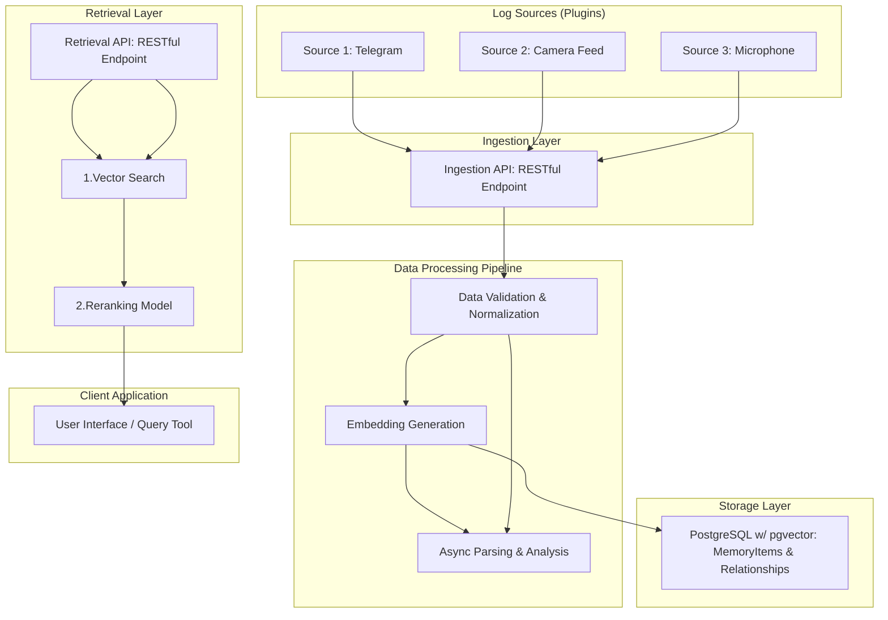

# Memory System

## 1. Overview

This document outlines the requirements for the Memory System, a backend service designed to ingest, store, and retrieve event logs from various sources. The system will process incoming data, generate text embeddings, and provide a powerful query interface to find the most relevant information using a retrieve-and-rerank mechanism.

### 1.1. Goals

*   To provide a centralized, long-term memory for various personal and environmental events.
*   To offer a flexible "publish-subscribe" model for integrating new data sources as plugins.
*   To enable efficient and contextually relevant retrieval of stored information.

### 1.2. Target Audience

*   **Primary:** Developers building applications that require a "memory" component (e.g., personal assistants, life-logging tools, security monitoring).
*   **Secondary:** Data analysts studying life patterns from the aggregated logs.

## 2. System Architecture

The system is composed of four main parts: the Ingestion Layer, the Data Processing Pipeline, the Storage Layer, and the Retrieval Layer.



*   **Ingestion API:** A secure RESTful API endpoint for log sources to publish their data.
*   **Data Processing Pipeline:**
    *   Receives data from the Ingestion API.
    *   Validates and normalizes the incoming data structure.
    *   Generates a vector embedding from the `analyzed_text` of the log.
    *   **Asynchronous Processing:** For complex data types (`web_link`, `image`, `audio_clip`), the Ingestion API places a job onto a **message queue** (e.g., RabbitMQ, Kafka, or AWS SQS). Worker services consume from this queue to perform deeper analysis:
        *   **Web Scraping & Chunking:** Fetches URL content, cleans it, and splits it into searchable chunks.
        *   **Image Analysis:** Uses multi-modal models to generate a textual description of image content.
        *   **Speech-to-Text:** Transcribes audio content.
        *   The results of these jobs create new `MemoryItem` nodes and link them to the original item.
*   **Storage Layer:**
    *   A PostgreSQL database with the `pgvector` extension. The schema is based on a graph model with `MemoryItems` (nodes) and `Relationships` (edges) to connect them.
*   **Retrieval API:**
    *   A RESTful API endpoint for clients to query the memory.
    *   Performs an initial semantic search using vector similarity.
    *   Refines the search results using a more powerful reranking model to provide the final, most relevant logs.

## 3. Data Model

The system moves away from a simple, flat log structure to a more powerful and flexible graph-based model. This allows for rich context and relationships between different pieces of information. The core consists of two tables: `MemoryItems` (the nodes of the graph) and `Relationships` (the edges connecting the nodes).

This model allows us to treat every piece of information—a text message, an image, a web link, a parsed article—as a distinct `MemoryItem`. These items are then linked together to represent conversations, references, or containment.

### 3.1. `MemoryItems` Table Schema

This is the central table storing every "information atom".

| Column Name               | Data Type                 | Description                                                                                                   | Nullable |
| ------------------------- | ------------------------- | ------------------------------------------------------------------------------------------------------------- | -------- |
| `id`                      | `UUID`                    | Primary Key.                                                                                                  | No       |
| `parent_id`               | `UUID`                    | Self-referencing key for hierarchical data, e.g., an article containing chunks.                               | Yes      |
| `content_type`            | `VARCHAR(50)`             | **Crucial field.** Type of item, e.g., `text_message`, `image`, `web_link`, `parsed_article`, `article_chunk`. | No       |
| `text_content`            | `TEXT`                    | The raw text content, if applicable (e.g., for a `text_message`).                                             | Yes      |
| `analyzed_text`           | `TEXT`                    | **The text used for embedding.** For an image, this is the AI-generated description. For an article, the summary. | Yes      |
| `data_uri`                | `TEXT`                    | A pointer to binary data, e.g., an S3 URL for an image or a local file path.                                  | Yes      |
| `embedding`               | `vector(2560)`             | The vector embedding of `analyzed_text`.                                                                      | Yes      |
| `embedding_model_version` | `VARCHAR(100)`            | The name and version of the model used to generate the embedding.                                             | Yes      |
| `meta`          | `JSONB`                   | Metadata about the origin, e.g., `{"app": "telegram", "chat_id": "12345", "author_id": "user_abc"}`.          | Yes      |
| `event_timestamp`         | `TIMESTAMPTZ`             | The real-world timestamp of the event (e.g., when a message was sent).                                        | No       |
| `created_at`              | `TIMESTAMPTZ`             | The timestamp when the record was created in the database. Defaults to `NOW()`.                               | No       |
| `updated_at`              | `TIMESTAMPTZ`             | The timestamp when the record was last updated. Defaults to `NOW()`.                                          | No       |

### 3.2. `Relationships` Table Schema

This table connects the `MemoryItems`, forming the contextual graph.

| Column Name         | Data Type     | Description                                                              | Nullable |
| ------------------- | ------------- | ------------------------------------------------------------------------ | -------- |
| `id`                | `UUID`        | Primary Key.                                                             | No       |
| `source_node_id`    | `UUID`        | The origin of the relationship (FK to `MemoryItems.id`).                 | No       |
| `target_node_id`    | `UUID`        | The destination of the relationship (FK to `MemoryItems.id`).            | No       |
| `relationship_type` | `VARCHAR(50)` | The nature of the link, e.g., `reply_to`, `mentions`, `parsed_from`.     | No       |
| `created_at`        | `TIMESTAMPTZ` | The timestamp when the relationship was created. Defaults to `NOW()`.    | No       |

### 3.3. Example Workflow: Ingesting a Web Link

1.  A user posts a message: "check out this article: https://example.com/ai-news".
2.  An initial `MemoryItem` is created:
    *   `content_type`: `web_link`
    *   `text_content`: "check out this article: https://example.com/ai-news"
    *   `data_uri`: "https://example.com/ai-news"
3.  An asynchronous job is triggered. It fetches the URL, parses the article content, and creates new `MemoryItems`:
    *   One `parent` item with `content_type`: `parsed_article`, `analyzed_text` containing a summary.
    *   Multiple `child` items with `content_type`: `article_chunk`, each with a `parent_id` pointing to the `parsed_article`. Each chunk has its own `analyzed_text` and `embedding`.
4.  A `Relationship` is created:
    *   `source_node_id`: The ID of the `parsed_article` item.
    *   `target_node_id`: The ID of the original `web_link` item.
    *   `relationship_type`: `parsed_from`.

## 4. API Specification

### 4.1. Ingestion API

#### `POST /api/v1/ingest`

Ingests a new `MemoryItem`. The system will handle relationship creation and async processing based on the item's type and content.

*   **Request Body:**

    ```json
    {
      "content_type": "text_message", // or "image", "web_link", etc.
      "text_content": "This is a sample message.", // Can be null if data_uri is present
      "data_uri": null, // Can be an S3 URL for an image, etc.
      "event_timestamp": "2025-07-17T10:00:00Z",
      "source_context": {
        "app": "telegram",
        "chat_id": "chat_id_12345",
        "author_id": "user_abc",
        "message_id": "msg_xyz"
      },
      // If this message is a reply, include the target ID
      "reply_to_id": "f47ac10b-58cc-4372-a567-0e02b2c3d479" 
    }
    ```

*   **Success Response (202 Accepted):**

    ```json
    {
      "status": "accepted",
      "item_id": "a1b2c3d4-e5f6-7890-1234-567890abcdef"
    }
    ```

### 4.2. Retrieval API

#### `GET /api/v1/retrieve`

Retrieves and ranks `MemoryItems` based on a query, with options to traverse their relationships.

*   **Query Parameters:**

| Parameter         | Type     | Description                                                              | Required |
| ----------------- | -------- | ------------------------------------------------------------------------ | -------- |
| `query`           | `string` | The natural language query text.                                         | Yes      |
| `top_k`           | `int`    | The number of results to return. Default: 10.                            | No       |
| `filters`         | `json`   | JSON object for filtering on `source_context` or other metadata.         | No       |
| `start_date`      | `string` | ISO 8601 timestamp for the start of the time range (`event_timestamp`).  | No       |
| `end_date`        | `string` | ISO 8601 timestamp for the end of the time range (`event_timestamp`).    | No       |
| `content_types`   | `string` | Comma-separated list of `content_type` to filter by.                     | No       |
| `include_context` | `bool`   | If true, also returns related items (e.g., replies). Default: false.     | No       |

*   **Success Response (200 OK):**

    The response now returns `MemoryItem` objects, and can optionally include a `context` block.

    ```json
    {
      "query": "lunch meeting tomorrow",
      "results": [
        {
          "item": {
            "id": "a1b2c3d4-e5f6-7890-1234-567890abcdef",
            "content_type": "text_message",
            "text_content": "User A said: let's meet for lunch tomorrow.",
            "event_timestamp": "2025-07-17T10:00:00Z",
            "source_context": { "app": "telegram", "author_id": "User A" }
          },
          "score": 0.95
        },
        {
          "item": {
            "id": "b2c3d4e5-f6a7-8901-2345-67890abcdef1",
            "content_type": "audio_clip",
            "analyzed_text": "Transcription: Confirmed, lunch meeting at 1 PM.",
            "event_timestamp": "2025-07-17T11:20:00Z",
            "source_context": { "app": "microphone" }
          },
          "score": 0.89
        }
      ]
    }
    ```

## 5. Non-Functional Requirements

*   **Scalability:** The system must be able to handle at least 100 ingestion requests per second. The database must be scalable to store terabytes of data.
*   **Performance:**
    *   Ingestion latency (from API call to data being persisted) should be < 200ms.
    *   Retrieval latency (p95) should be < 500ms for a standard query.
*   **Security:** All API endpoints must be protected by API key authentication. Data should be encrypted at rest and in transit.
*   **Configurability:** The embedding model and reranking model should be configurable without requiring a full system redeployment.
*   **Observability:** The system must expose metrics (e.g., via Prometheus) for monitoring request rates, latency, and error rates. It should produce structured logs for easier debugging.

